# İlk hafta Atolyelerinin içeriği

- Mobil programlama nedir? Neden önemlidir?
- Mobil programlamayı diğer alanlardan ayıran farklar
- Cross platform ve Native kavramları
    - Native Programlama dilleri
    - Cross Platform programlama dilleri
- Flutter nedir?
- Flutter ve React Native
- Git ve Github

---
## Cross Platform ve Native Kavramları
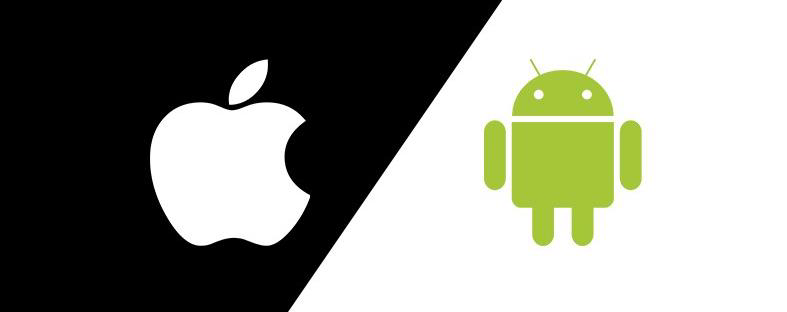

## Cross Platform ve Native Kavramları
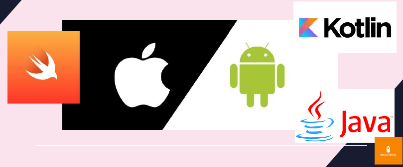

## Cross-platform Programlama Dilleri

## Flutter nedir?
- Google
- 2019
- Android, iOS, Windows, Mac, Linux ve web
- Performans
- kolaylık

---
## Flutter

- Google
- 2019
- Android, iOS, Windows, Mac, Linux ve web
- Performans
- Dart

## React Native
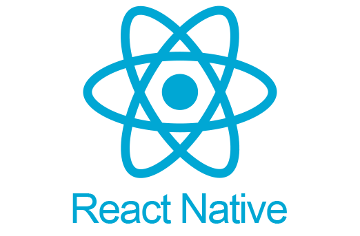
- Facebook
- 2015
- Android, iOS, Windows, Mac, Linux ve web
- Öğrenim kolaylığı
- JavaScript

## ANDROİD STUDİO NEDİR?

**ANDROİD STUDİO VE FLUTTER SDK KURULUMU**

- Flutter kurulum linki
- Flutter SDK & Android Studio & Visual studio Code kurulumu

---
## Git & Github nedir? Kısaca tanıtım
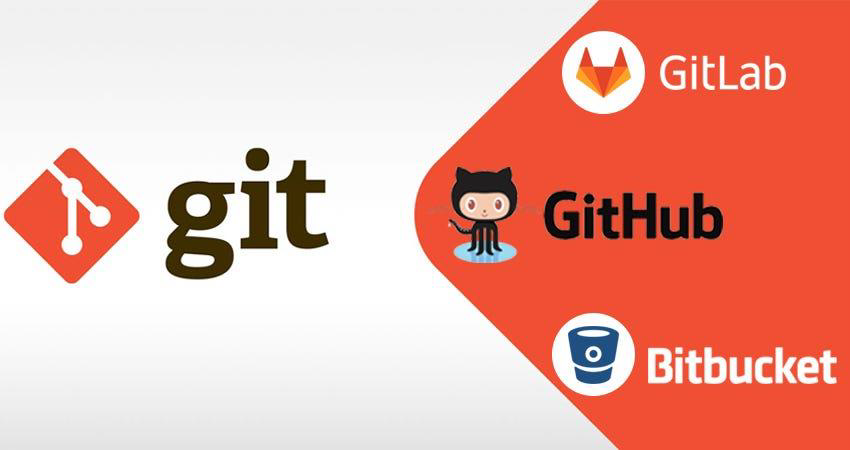
**Git**
- Versiyon kontrol sistemi ihtiyacı
- Artık bir endüstri standartı
- Mülakatlarda karşınıza çıkacaktır.

**Github**
- Git repo (projelerimizi sakladığımız yer)
- interaktif
- Birçok alternatifi var

## Git Kurulumu (Windows)
- Google'a git install yazıp ilk çıkan linkten git'i bilgisayarımıza indiriyoruz.
- Exe kurulum dosyasını açın.

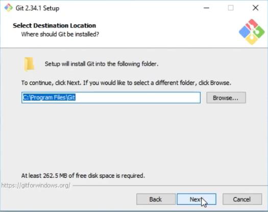
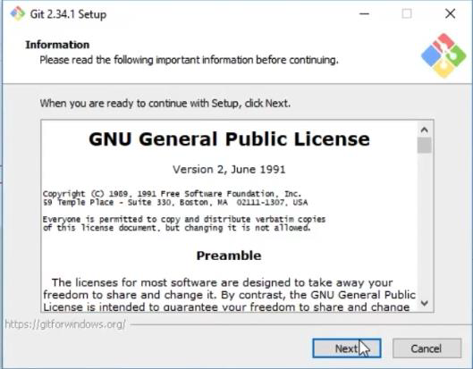
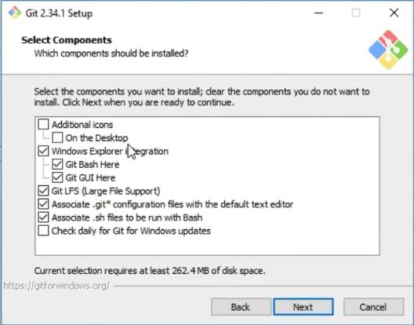
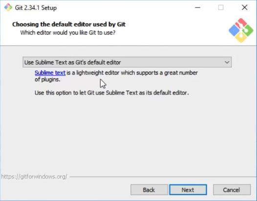
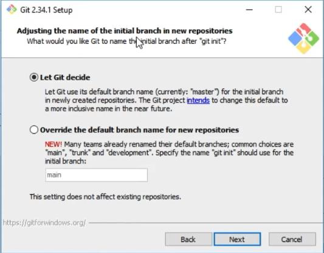
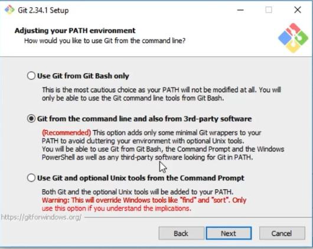
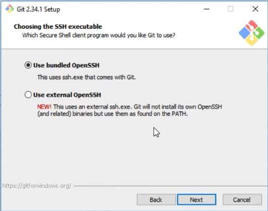
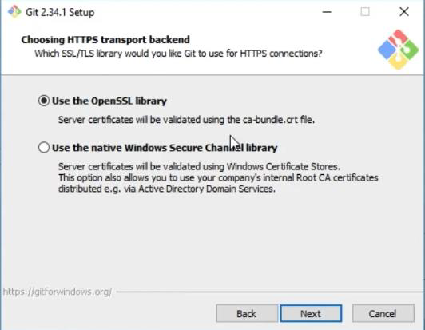
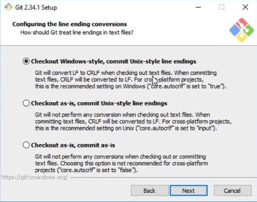
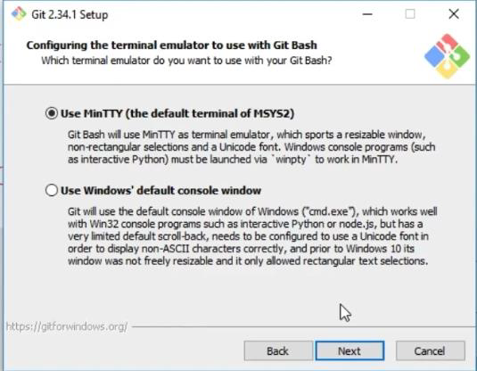
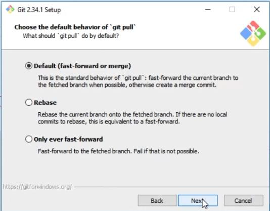
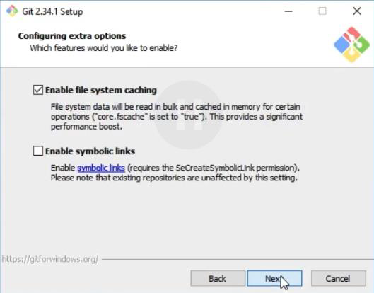
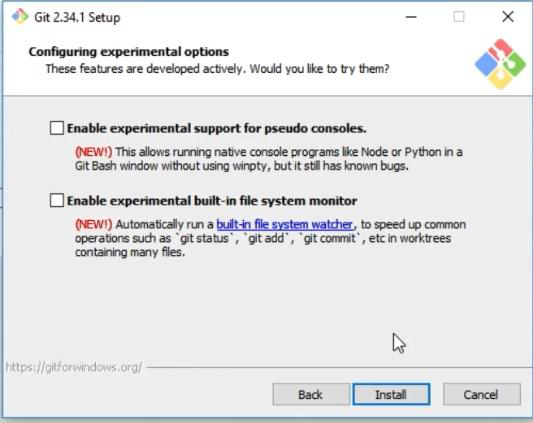

## Git kurulumu(MacOs)
**Git var mı kontrolü:**
- İlk olarak terminalimizi açıyoruz. (cmd+space)
- Git version
- Git yazıp enter'a basıyoruz. Eğer altta şöyle bir yazı çıkmışsa:
- Git --version yazıp git'imizin versiyonunu öğrenebiliriz.

**Eğer git yüklü değilse:**
- Google'a git download yazıp MacOs'u seçiyoruz.
- Installer'la git'i kurabiliriz.
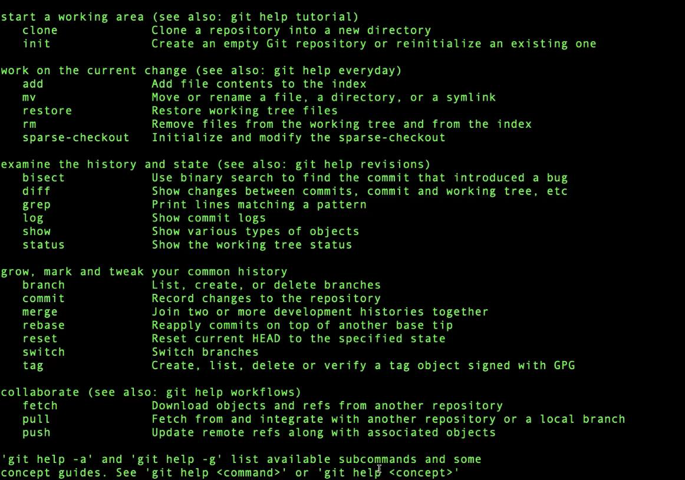

## Terminal kullanımı
**Powershell vs CMD (komut satırı):**
- Powershell cmd'nin daha gelişmiş halidir.(Baş harfler küçük olmalı!)

**Terminal komutları:**
- Pwd -->bulunduğumuz yeri belirtir.
- Dir-> bulunduğumuz yerdeki dosyaları belirtir.
- Ls ->vulunduğumuz yerdeki klasörleri gösterir.
- Cd ..-> bir adım geri çık.
- Clear ->Ekran temizlenir.
- Mkdir dosyaadi -> bulunduğun yerde klasör oluşturur.
- Rm dosyaAdi-> dosyayı siler.

## E mail'imizi git sistemimize kaydetmek
Herhangi bir kullanıcı adı ve şifreyi kaydedebilirsiniz. Sonradan da ğiştirebilirsiniz.
- Git Bash'e girdik.
- Git config –global user.name "kullanici isminiz"

Username'inizi görmek:
- Git config user.name
- Git config –global user.email adsadasdasd@gmail.com

## Önemli Git Komutları
**Git status:**  O dizinde git var mı bunun kontrolünü sağlarız.
- git status

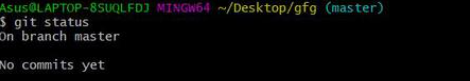
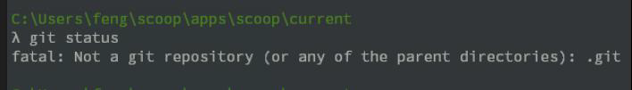

---

**Git init:** Bir dizini boş bir Git deposuna dönüştürür.
- git init

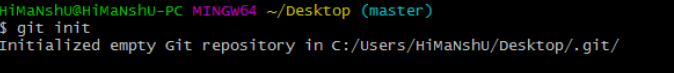

---

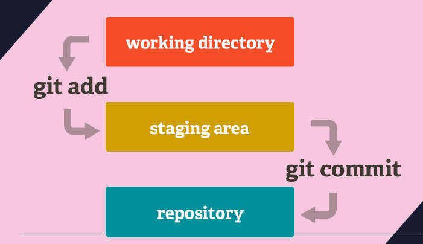

---

**Git add:** Git'e dosyaları vb. eklemeyi sağlar.
- git add ilkdosya.py
- Git add .

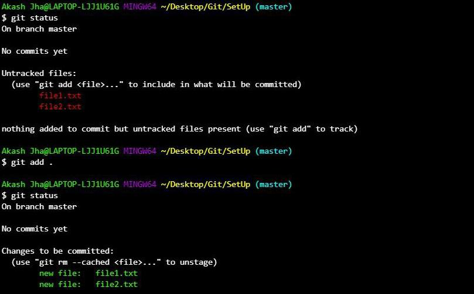

---

**Commit:** Değişiklikleri kaydetmemizi sağlar. (Checkpoint)
- Git commit –m " Ana sayfa tasarımı koda döküldü."

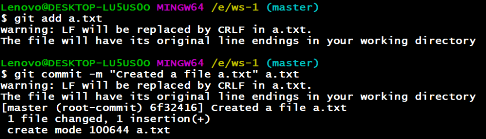

---
**Git Log:** Projede yapılan önceki bütün event'leri gösterir.
- Git log

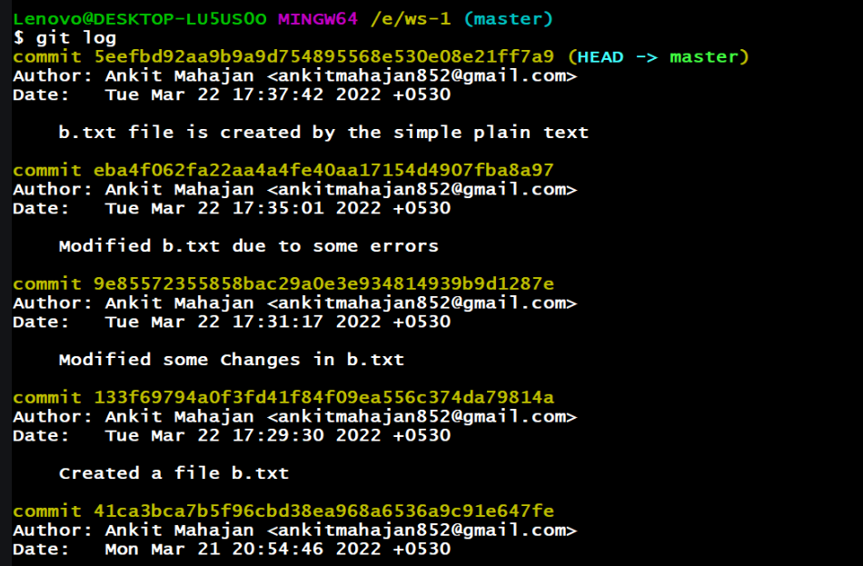

